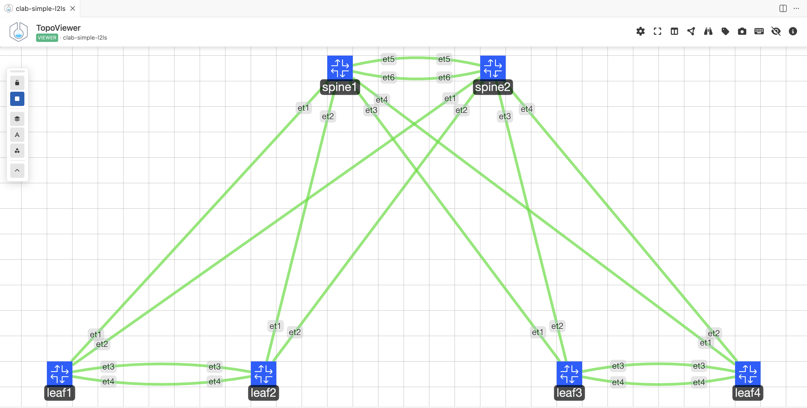

# Containerlab Simple L2LS Topology

This topology is meant to be used with Arista Labs UCN Sandbox.



## Clone to your Lab

``` bash
git clone https://github.com/PacketAnglers/clab-simple-l2ls.git
```

## Start the Lab

``` bash
clab deploy -t topology.clab.yml
```
